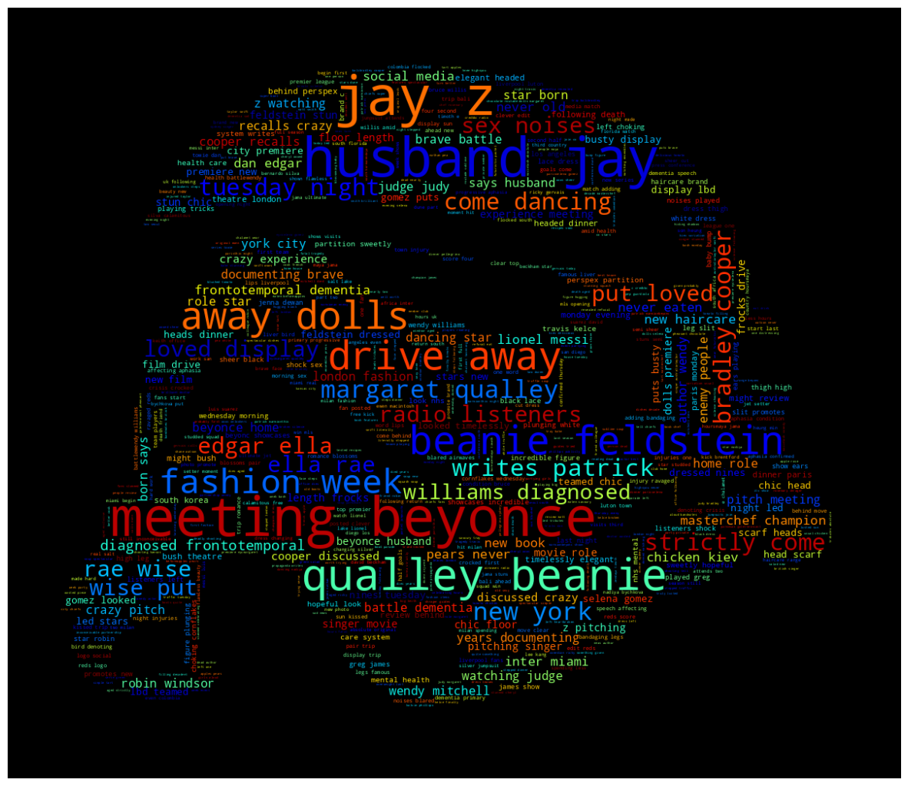
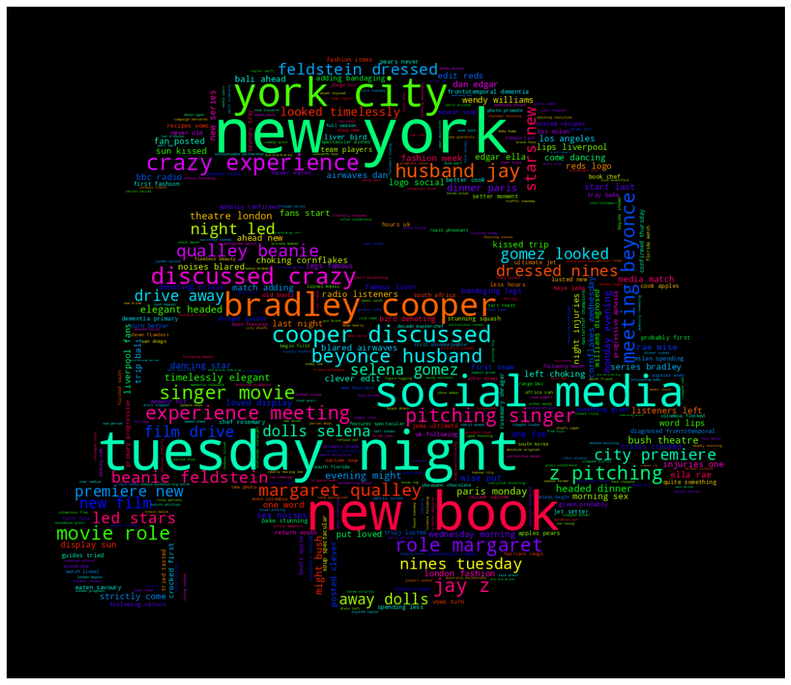
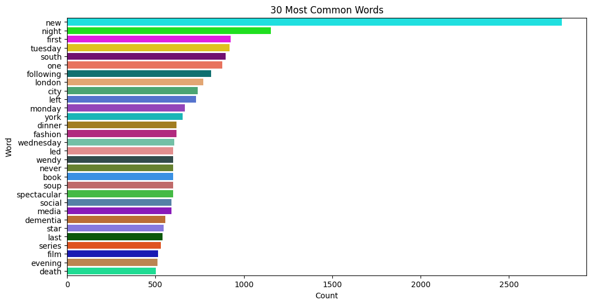
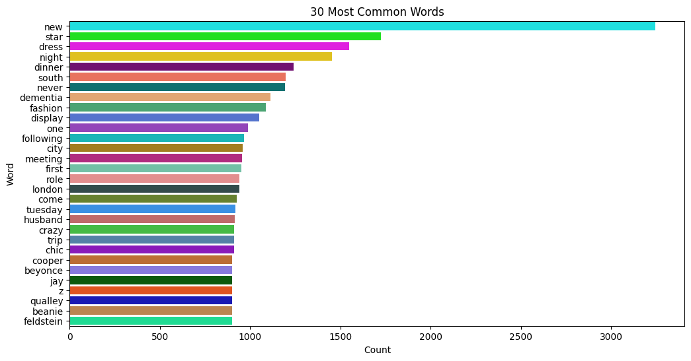
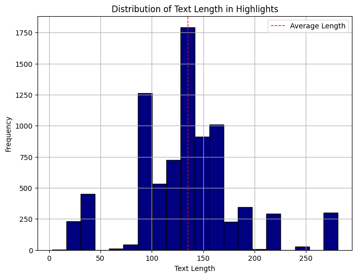
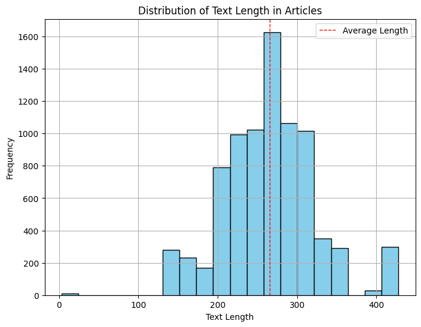
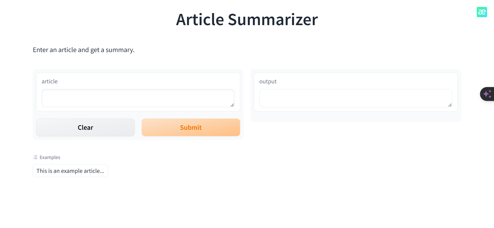
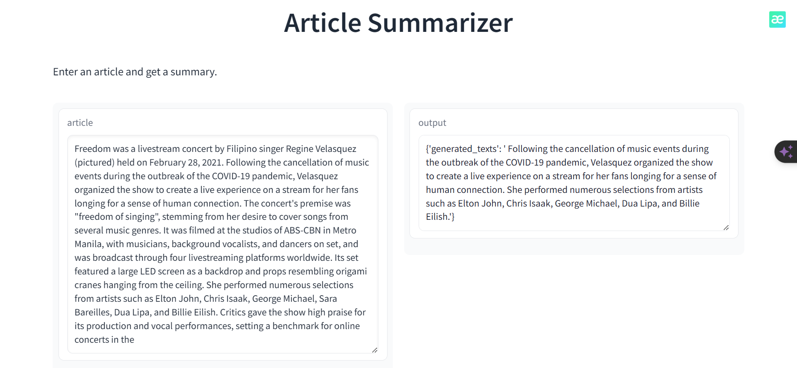
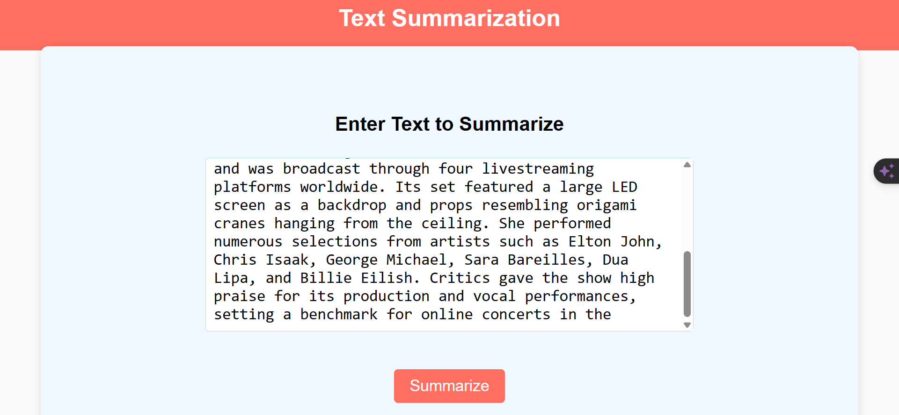
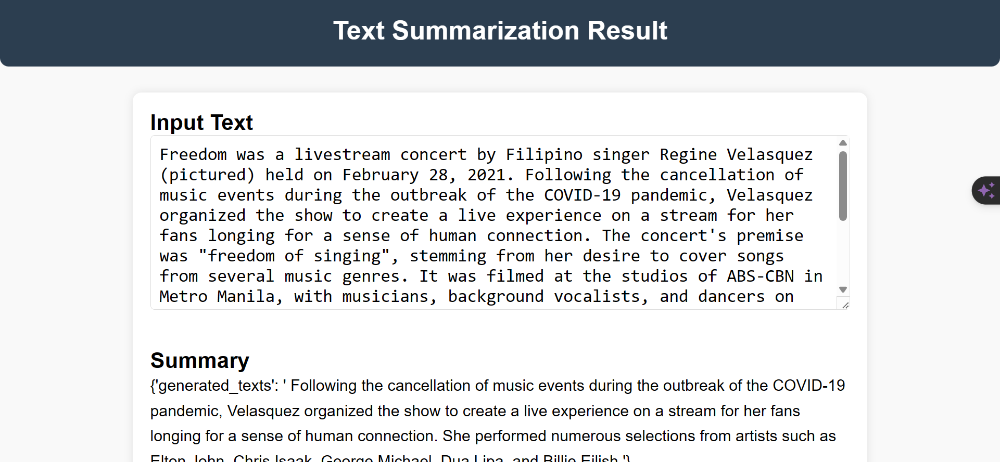

# Text-Summarizer

***Utilizing Hugging Face Transformers and Blurr, I streamlined data scraping and text summarization. Three specialized models were integrated seamlessly, allowing for accurate summaries. Deployment on Hugging Face Spaces ensured easy sharing and accessibility. This project showcases the efficiency of modern NLP for succinct text summarization.***

***Article Wordcloud***

***Highlights Wordcloud***

***Most Common Words in Highlights***

***Most Common Words in Article***

***Highlights Text Length***

***Article Text Length***

# Model Deployment
The text summarization model has been deployed on the HuggingFace Spaces Gradio App. You can access the implementation either by going to the deployment folder or directly through the provided [link](https://huggingface.co/spaces/jarif/Summarization) to the application.

# Web Deployment

***I've developed a Flask application specifically for text summarization. It's designed to take input text and generate a condensed summary. You're invited to explore the Flask branch to delve into the implementation details further. To try out the application in real-time, simply visit the live website accessible through the provided [link](https://text-summarizer-z6vl.onrender.com/).***

